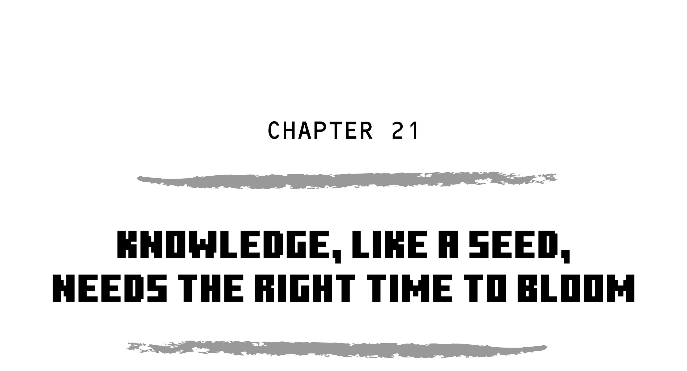

“How do I survive?” I asked the darkness. “What’s my next move?”

Trapped, cornered, alone.

Well, almost.

“Guhhh,” moaned the zombie on the other side of the wall, completing my déjà vu.

“Same as it ever was,” I answered. “Just like my first night.”

And then something happened that I never would have predicted: I smiled.

“My first night,” I repeated, setting down a comforting torch, “and look what I had then compared to what I have now.”

“Guhhh,” snarled the ghoul. Two actually, as I could hear a second one approaching.

“No, not in my pack,” I laughed, wishing I could point to my head. “Up here! All those priceless lessons in my brain, all that hard-won experience. You can’t take that away. Nobody can. This isn’t the same as my first night because I’m not the same person!”

“Guhhh,” growled the monsters.

“We’ll talk later,” I said, turning my back on the wall. “I gotta get to work.”

I took a deep breath and visualized the Way of the Cube: Plan, Prepare, Prioritize, Practice, Patience, Persevere.

Right now I had to prioritize my needs, and need number one was food. The spider’s sting had ripped every last calorie out of me. My head swam, my breath stank, and those tiny, telling shivers were back. Starvation.

_Been a long time,_ I thought, searching my belt and pack.

All I had was one brown mushroom, totally inedible without its red and white partner.

The rest of my inventory consisted of two dozen blocks of birch, twenty blocks of oak that I’d hacked out of the mineshaft supports, three empty metal buckets, one bucket of water, a worn shovel, a worn bow, a worn pickaxe, a ton of cobblestone, some gunpowder, some redstone, three books on redstone, a bundle of feathers, and enough spider silk to make an army of fishing poles.

“Too bad there aren’t any oceans nearby,” I muttered. But right on the heels of those defeatist words came an exultant “There is!”

Like a crack of lightning, the memory of the food book’s passage flashed across my mind. “Any body of water,” it had read. _Any_ body! That lifesaving fact then merged with my firsthand experience with irrigation. Remember way back when I bored you to death with my story of pouring water in a ditch? Remember when I said how important it would be later on? Well, later on was now.

“Water makes water!” I called to the zombies outside. “All I need now’s a second cube.”

“Uhhh,” they responded, reminding me that there was more water…right out there with them.

Of course I’m talking about the little underground stream I’d fallen into after almost being blown up. I thought I’d seen the source: a single cube spring in the wall just a few paces from this cave. But how to get there?

I thought about the two end-around tunneling tactics I’d tried before. Both had been risky, and neither had ended well.

But now, with water so close…

“With great risks come great rewards!” I called to my undead jailors, and hoisted my nearly broken pickaxe.

I began hammering away, estimating where the water’s source was. “And here we…”

I turned sharply to the left. The block fell. No water, just a couple of rotting hands.

I yelped as one green fist punched me square in the honker.

“Thanks,” I said, sealing up the hole. I don’t think zombies can laugh, but those moans sure sounded cheery. Clearly they were following me on the other side of the tunnel. If I made another mistake, broke through and took more damage I couldn’t heal from…

SNAP. The iron tool broke in my hands.

“No problem!” I called to the zombies, and whipped up first a crafting table, then a stone-tipped pickaxe. “Perseverance!” Turns out I only had one more block to go. Pick, pick, pick, then WHOOSH! Underground water!

Capturing it in an empty milk pail, I dug out a large basin in the center of the cave.

Jumping inside, I poured the two water cubes against two of the corners. As they flowed together, a third cube formed between them. I repeated the process again and again and again until soon I was climbing out of a fully-filled pool.

“And here we go,” I said, crafting a new fishing pole.

“Uggghhh,” taunted one of the zombies.

“You’re right,” I hollered back. “No reason to think any body of water also means one I made. But,” I said, stepping back to cast out, “you should never assume anything.”

Nothing. Not even bubbles on the surface.

“Patience,” I warned my ghoul captors. “You’ll see, I just need to be pa—”

And there it was! That little, lifesaving V of bubbles.

“C’mon,” I coaxed, waiting for the V to zigzag toward my hook. My bobber sank, the pole yanked, and an impossible salmon came flying up into my belt, along with a new lesson. Knowledge, like a seed, needs the right time to bloom.

As the day, or night, or whatever it was, wore on, my belt pouches overflowed with fish. My newly-crafted furnace filled the cave with delicious smells, and eventually the zombies, unlike my stomach, were the only things left growling.

Oh, and just in case you’re wondering, yes, it did bother me having to kill to live, but if you go back a few chapters, you’ll see, and I quote, if “pushed to the brink of starvation with no other choices left.” Compromising an ideal in order to save it. Vegetarian to temporary pescatarian. Okay? We cool?

Moving on to my next priority: making a bed. Nothing clears the mind like a good night’s sleep.

Trying to recall what I’d read about crafting wool blocks from webs, I began setting the rest of my spider twine on the crafting table. Crazy as it sounds, they combined into several soft, wooly cubes. Three wood planks later, I had a bed no different than any I’d made before. Even the blanket and pillow felt as smooth and soft as sheep’s wool.

“It’s going to be okay,” I told myself, as the walls of my cave faded to black. “Tomorrow, I’m gettin’ outta here.”

But tomorrow, as they say, was _not_ just a day away. The next morning, I realized that trying to make a hasty run for it would probably put me in the same position that I was in now, if not worse.

I was totally unarmed, with half my body unarmored. No milk meant I’d need ten times as much food to counter spider poison, and, let’s not forget, I had no idea where I was going.

As badly as I wanted to escape the stuffy, cramped confines of my cave, I needed to repair, restock, and rethink my overall exit strategy. Like it or not, this underground chamber was going to be home for a while.

I spent two full days catching a school of fish. Once that priority was checked, I turned to the next on the list: armor and weapons.

Using the last of my worn shovel to dig out a dirt section of the wall, I found a cache of three iron cubes. _Just the start,_ I thought optimistically, and picking them out, I broke through to another cave.

“Whoa,” I said, backing up quickly. No mobs came through and no sounds warned of their presence. Peeking in, all I could see were a few small red and white caps dotting the floor. Mushrooms.

“Figures,” I said sourly. “All that time catching fish and I could have been collecting food right here.”

_But then again,_ I reminded myself, _learning to make a fishing hole anywhere means you’ll never ever starve again._

Problems force progress.

Long story short, I’m not a fan of mushroom stew. Too creamy and bland. But, at least I didn’t have to kill to eat anymore. See, I care!

And—this is a big ol’ AND—mushrooms grow by themselves. Just place one on the stone floor with dim light and it’ll make more of itself. So they not only cleared my conscience, they cleared my calendar, freeing me up to go mining.

And mine I did. By the ninth or tenth day, I had found enough iron and coal to forge tools, weapons, and a whole new suit of armor.

It was time to get home, but how? I still didn’t know where I was going, and the path I’d taken before was way too dangerous.

I thought about maybe tunneling straight, spiral staircase style. Hopefully, I’d break through onto my island, maybe right by Moo and the sheep.

I didn’t. I must have been close though, maybe at the foot of one of the slopes, because eventually I broke through to a column of sand. _The beach!_ I thought happily, and shoveled the tan block away, and the one that fell in after that, and the one that fell in after that, on and on and on until seawater eventually washed me right back down into my cave.

_Plan B,_ I thought, gloomily sealing up the breach. Plan B meant trying to tunnel far enough around the mob-infested passages to hopefully break through into another open shaft.

It didn’t go exactly as planned. On the first try I broke through into an open lava cave, its walls lined with gold and diamonds. “You can’t help me now,” I sneered at the treasure, and tunneled in another direction. This time I finally got what I was looking for: a silent, clear shaft with no mobs anywhere in sight. Even better, the lack of torches told me I’d never been down this way.

“Home,” I breathed, already tasting the sea air. Taking one step into the passageway though, I turned to my left and saw another minecart.

Throwing open the lid, I found some iron ingots, some gunpowder, a loaf of very welcome bread, and most important, another book entitled _Navigation._

At that moment, I felt like the luckiest person ever.

“Guhhh…”

A zombie lurched around the corner, cracking its fist on my face. I staggered back a half step, took the second blow square on my new shield, then laid in with a series of chops from my new iron sword. Filling the hall with death smoke filled my heart with pride. I was back. I was ready. I was…

…facing three more coming down the hall.

_Must be near the spawner,_ I thought, blocking up the tunnel behind me. Plan B was dead. Time for Plan C, which I didn’t have yet. Hopefully this new book on navigation would help with that.

And it did!

There were four items described in the manual: a map, a compass, signposts, and, of all things, a journal. I couldn’t make the map because I needed sugarcane for paper, and I couldn’t make the journal for the same reason. The signposts were easy though, since they were just made of wood, and the compass only needed iron and redstone.

Unlike the compasses of my world, the needle didn’t point north. Instead the book said it always faced my “original spawning point.” Not immediately helpful, when you consider that was the bottom of the ocean, but since it always faced the same direction, I could use that consistency to keep me from getting turned around.

Laying the compass ingredients on the crafting table reminded me of how useless redstone had originally been, which, in turn, reminded me that I still had the three redstone books in my pack.

I hadn’t looked at them since the initial discovery, and even then, I’d only skimmed them. _Did I miss anything useful?_ I wondered, now carefully re-reading each page.

And indeed I had, rushing to take in all the fancy, cool machinery, skipping whole passages that didn’t grab my attention right away.

Details make the difference.

Book three, page five, one simple sentence: “Redstone Torches can be used as the detonation source for TNT.”

TNT!?

The gunpowder! _That’s_ what it was for!

TNT, which stands for…well, I don’t know, but I sure knew what it did!

The book didn’t say anything else about TNT, and I didn’t need to know.

And you don’t need to know everything I did in the underground month that followed. That’s how long I spent down there, learning to craft TNT from gunpowder and sand, then testing it in the water-cooled lava cave I’d found. You don’t need to know about the diamonds I mined for a new sword and armor, or the flint I gathered for more arrows, or how I used those arrows on silent raids, sneaking out of my cave to snipe at creepers for their gunpowder. Last but not least, you don’t need to hear every detail about the masses of machines I learned how to build and test and weave into my elaborate, meticulous plan. All you need to know is one word.

I was still going to escape, but not before destroying every spawner and random mob I could find. This wasn’t hotheaded revenge anymore. This was cold calculation. This would finally make my island, above and below, completely safe. This was the one word you need to know, the word from my world that isn’t nice but is sometimes necessary. I was now going to bring that word to this world.

I was going to war.
